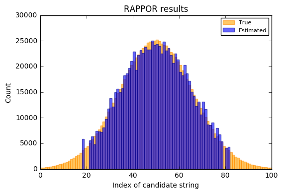

# RAPPOR

## Settings

These are the settings for the RAPPOR algorithm itself:


```python
k = 128
h = 2
m = 100
f = 0
p = 0.65
q = 0.35
```

The reported values can either be hashed using `md5` or `sha256`.
In Google's repository, `md5` is used. For generated datasets, the choice shouldn't really matter. For custom datasets, it's important to choose the same hash function that was also used for the data collection.


```python
hash_function = ["md5", "sha256"][0]
```

### Option 1: Data Generation

You can either automatically let this notebook generate data, or load an existing dataset.


```python
n = 1000000
M = 100
distribution = ["normal", "exponential", "uniform", "zipf1", "zipf1.5"][0]
```

### Option 2: Loading an existing dataset

If you already have a dataset that you want to load, change this flag to `False`:


```python
generate_data = True
```

`clients` should then be a Python list that contains tuples.
The first element for each tuple is a numpy array that contains the reported bits. The second element is an integer that describes which cohort the respective user is assigned to.


```python
clients = []
```

### Candidates

If you want to check for specific values, `candidates` should be a list of them.


```python
candidates = []
```

If your dataset also contains the true counts, `true_counts` can be a list with the true counts for the given candidate strings.


```python
true_counts_available = False
true_counts = []
```

If the dataset is automatically generated, `true_counts` is filled with the correct data and `candidates` defaults to all reported values.

---

## Hash function


```python
sc.addPyFile("client/rappor.py")
sc.addPyFile("client/hmac_drbg.py")
```


```python
from rappor import get_bloom_bits as get_bloom_bits_md5
from hashlib import sha256
```


```python
def get_bloom_bits_sha256(value, cohort, h, k):
    bits = []
    
    for hi in range(h):
        seed = str(cohort) + str(hi)
        digest = sha256(seed + value).digest()

        bit = ord(digest[-1]) % k
        bits.append(bit)

    return bits
```


```python
hash_functions = {
    "sha256": get_bloom_bits_sha256,
    "md5": get_bloom_bits_md5
}
```


```python
if hash_function in hash_functions:
    get_bloom_bits = hash_functions[hash_function]
else:
    raise NotImplementedError("Unimplemented hash function")
```

## Data Generation

### Distributions


```python
import numpy as np
from functools import partial
from scipy.stats import rv_discrete
```


```python
def sample_normal(n, M):
    return np.floor(np.random.normal(M / 2, M / 6, size=(n)))
```


```python
def sample_uniform(n, M):
    return np.floor(np.random.uniform(0, M, size=(n)))
```


```python
def sample_exponential(n, M):
    return np.floor(np.random.exponential(scale=M/5, size=(n)))
```


```python
def sample_custom_zipf(s, n, M):
    pdf = 1. / np.array(range(1, M))**float(s)
    pdf = pdf / pdf.sum()
    distribution = rv_discrete(name='zipf1', values=(range(len(pdf)), pdf))
    return distribution.rvs(size=n)

def sample_zipf(s):
    return partial(sample_custom_zipf, s)
```

While it doesn't happen often, the distributions above can generate values that are not between $0$ and $M$. In this case, we filter them out and resample new values until we have $n$ valid values.


```python
def filter_out_of_bounds(seq, lower, upper):
    seq = seq[seq >= lower]
    seq = seq[seq < upper]
    return seq
```


```python
def sample(n, M, distribution=sample_normal):
    data = distribution(n, M)
    data = filter_out_of_bounds(data, 0, M)
    
    while len(data) < n:
        additional_data = distribution(n - len(data), M)
        additional_data = filter_out_of_bounds(additional_data, 0, M)
        data = np.append(data, additional_data)
    
    return data
```

### Candidate Generation


```python
def generate_candidates(M):
    return ["v%d" % i for i in range(1, M + 1)]
```


```python
if len(candidates) == 0:
    candidates = generate_candidates(M)
```


```python
distribution_map = {
    "normal": sample_normal,
    "exponential": sample_exponential,
    "uniform": sample_uniform,
    "zipf1": sample_zipf(1),
    "zipf1.5": sample_zipf(1.5)
}
```


```python
used_distribution = distribution_map[distribution]
indices = sample(n, M, distribution=used_distribution)
```


```python
reported_values = [candidates[int(i)] for i in indices]
```

### Assignment to cohorts

We can reuse the sampling functions we create earlier! Here, all users are assigned to cohorts uniformly randomly. The same logic is used in the shield study.


```python
cohorts = map(int, sample(n, m, distribution=sample_uniform))
```

### Generating user reports


```python
def build_bloom_filter((reported_value, cohort)):
    set_bits = get_bloom_bits(reported_value, cohort, h, k)
    
    bits = np.zeros(k)
    bits[set_bits] = 1
    
    return bits, cohort
```

The individual bits are flipped according to Bernoulli distributions with probabilities $f, p, q$.
Because numpy doesn't have helpers for these, we use the equivalent binomial distributions with $n = 1$.


```python
def bernoulli(p, size):
    return np.random.binomial(n=1, p=p, size=(size))
```


```python
def build_prr((bits, cohort)):
    randomized_bits = np.where(bernoulli(f, k))[0]
    bits[randomized_bits] = bernoulli(0.5, len(randomized_bits))
    return bits, cohort
```


```python
def build_irr((bits, cohort)):
    result = np.zeros(k)
    set_bits = np.where(bits == 1)[0]
    unset_bits = np.where(bits == 0)[0]
    
    result[set_bits] = bernoulli(q, len(set_bits))
    result[unset_bits] = bernoulli(p, len(unset_bits))
    
    return result, cohort
```


```python
if generate_data:
    rdd = sc.parallelize(zip(reported_values, cohorts))
    rdd = rdd.map(build_bloom_filter).map(build_prr).map(build_irr)
    clients = rdd.collect()
```

### True counts


```python
if generate_data:
    true_counts = np.zeros(M)
    idx, counts = np.unique(indices, return_counts=True)
    idx = map(int, idx)
    true_counts[idx] = counts
    
    true_counts_available = True
```

## Analysis

### Summing

Individual user reports are not very useful to us, instead we need to sum up how often each bit position was reported.

We're using the variable conventions from the paper here. $N$ is a vector containing the number of reports from the individual cohorts. $c$ is a matrix
where $c_{ij}$ tells us how often bit $j$ was set in cohort $i$.


```python
c = np.zeros((m, k))
N = np.zeros(m)

for bits, cohort in clients:
    c[cohort] += bits
    N[cohort] += 1
    
c = c.T
```

### Target values `y `


```python
def estimate_bloom_count(c, N):
    Y = c - ((p + 0.5 * f * q - 0.5 * f * p) * N)
    Y /= ((1 - f) * (q - p))
    return Y
```


```python
def get_target_values(c, N):
    Y = estimate_bloom_count(c, N)
    return (Y / N).T.reshape(k * m)
```


```python
y = get_target_values(c, N)
```

### Data matrix `X`


```python
def get_features(candidates):
    matrix = []

    for cohort in range(m):
        rows = []

        for candidate in candidates:
            bits = np.zeros(k)
            bits_set = get_bloom_bits(candidate, cohort, h, k)
            bits[bits_set] = 1
            rows.append(bits)

        for row in np.array(rows).T:
            matrix.append(row)

    X = np.array(matrix)
    
    return X
```


```python
X = get_features(candidates)
```

### Fitting


```python
from scipy.optimize import nnls
```


```python
def fit(X, y):
    x0, _ = nnls(X, y)
    return x0
```


```python
params = fit(X, y)
```

### Significance test


```python
from scipy.stats import t
from numpy.linalg import inv, norm
```


```python
significance_level = 0.05
bonferroni_corrected_level = significance_level / M
```


```python
predictions = X.dot(params)
num_datapoints, num_features = X.shape
MSE = norm(y - predictions, ord=2)**2 / (num_datapoints - num_features)
```


```python
var = MSE * inv(X.T.dot(X)).diagonal()
sd = np.sqrt(var)
ts = params / sd
```


```python
degrees_of_freedom = num_datapoints - 1
p_values = np.array([2 * (1 - t.cdf(np.abs(i), degrees_of_freedom)) for i in ts])
```


```python
significant_i = np.where(p_values <= bonferroni_corrected_level)[0]
significant = params[significant_i]
```


```python
analyzed = np.zeros(M)
analyzed[significant_i] = significant
estimates = analyzed * N.sum()
```

## Presenting the results

### Listed


```python
from pandas import DataFrame
```


```python
def create_estimate_df(candidates, estimates, original, true_counts_available):
    indices = np.argsort(estimates)[::-1]
    reported_candidates = [candidates[i] for i in indices]
    reported_estimates = np.array(estimates[indices], dtype=np.int32)
    
    columns = ["Candidate", "Estimated count"]
    
    if true_counts_available:
        reported_original = np.array(original[indices], dtype=np.int32)
        data = np.array(zip(reported_candidates, reported_estimates, reported_original))
        columns.append("Actual count")
    else:
        data = np.array(zip(reported_candidates, reported_estimates))

    df = DataFrame(data=data)
    df.columns = columns
    return df
```


```python
create_estimate_df(candidates, estimates, true_counts, true_counts_available).head(15)
```


<div>
<table border="1" class="dataframe">
  <thead>
    <tr style="text-align: right;">
      <th></th>
      <th>Candidate</th>
      <th>Estimated count</th>
      <th>Actual count</th>
    </tr>
  </thead>
  <tbody>
    <tr>
      <th>0</th>
      <td>v49</td>
      <td>24985</td>
      <td>24683</td>
    </tr>
    <tr>
      <th>1</th>
      <td>v54</td>
      <td>24835</td>
      <td>24116</td>
    </tr>
    <tr>
      <th>2</th>
      <td>v51</td>
      <td>24364</td>
      <td>25252</td>
    </tr>
    <tr>
      <th>3</th>
      <td>v50</td>
      <td>24155</td>
      <td>25010</td>
    </tr>
    <tr>
      <th>4</th>
      <td>v52</td>
      <td>23961</td>
      <td>24959</td>
    </tr>
    <tr>
      <th>5</th>
      <td>v46</td>
      <td>23797</td>
      <td>24096</td>
    </tr>
    <tr>
      <th>6</th>
      <td>v56</td>
      <td>23611</td>
      <td>23469</td>
    </tr>
    <tr>
      <th>7</th>
      <td>v47</td>
      <td>23297</td>
      <td>24669</td>
    </tr>
    <tr>
      <th>8</th>
      <td>v48</td>
      <td>23255</td>
      <td>24866</td>
    </tr>
    <tr>
      <th>9</th>
      <td>v44</td>
      <td>23194</td>
      <td>23065</td>
    </tr>
    <tr>
      <th>10</th>
      <td>v55</td>
      <td>23088</td>
      <td>24022</td>
    </tr>
    <tr>
      <th>11</th>
      <td>v41</td>
      <td>22858</td>
      <td>20928</td>
    </tr>
    <tr>
      <th>12</th>
      <td>v45</td>
      <td>22591</td>
      <td>23554</td>
    </tr>
    <tr>
      <th>13</th>
      <td>v59</td>
      <td>22462</td>
      <td>21852</td>
    </tr>
    <tr>
      <th>14</th>
      <td>v53</td>
      <td>22461</td>
      <td>24404</td>
    </tr>
  </tbody>
</table>
</div>


### Visually


```python
import matplotlib.pyplot as plt
%matplotlib inline
```


```python
handles = []
labels = []

if true_counts_available:
    original_bar = plt.bar(range(M), true_counts, width=1., color='orange', edgecolor='darkorange', alpha=0.6)
    handles.append(original_bar)
    labels.append("True")
    
reported_bar = plt.bar(range(M), estimates, width=1., color='blue', edgecolor='darkblue', alpha=0.6)
handles.append(reported_bar)
labels.append("Estimated")

plt.title("RAPPOR results")
plt.legend(handles, labels, prop={'size': 8})
plt.xlabel("Index of candidate string")
plt.ylabel("Count")
plt.show()
```




